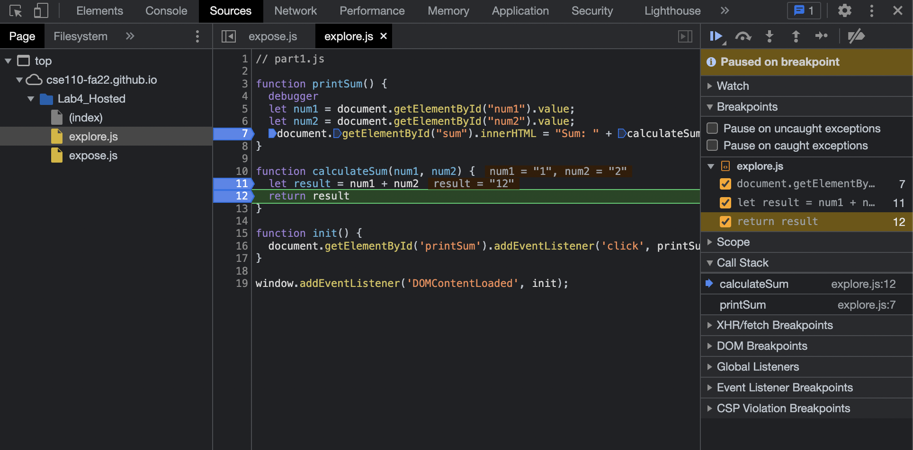
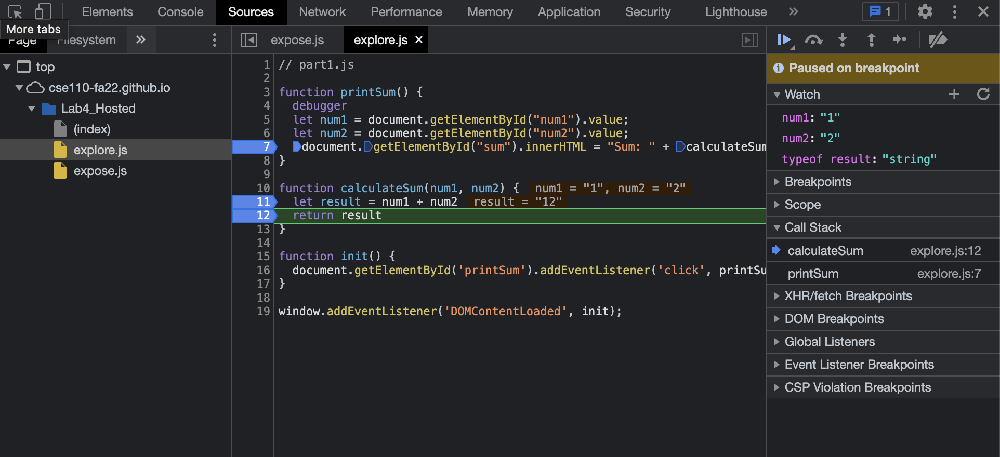
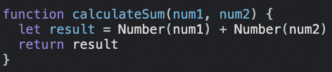

### Breakpoints 

### Watch

1. The bug is that explore.js is adding the two input numbers together as two strings, which results in just concatenating them and returning another string instead of actually adding their values. 

2. The fix is to convert the two input values to numbers and then add them together instead of just directly taking the input and adding them together, as shown in the new code below for calculateSum().

